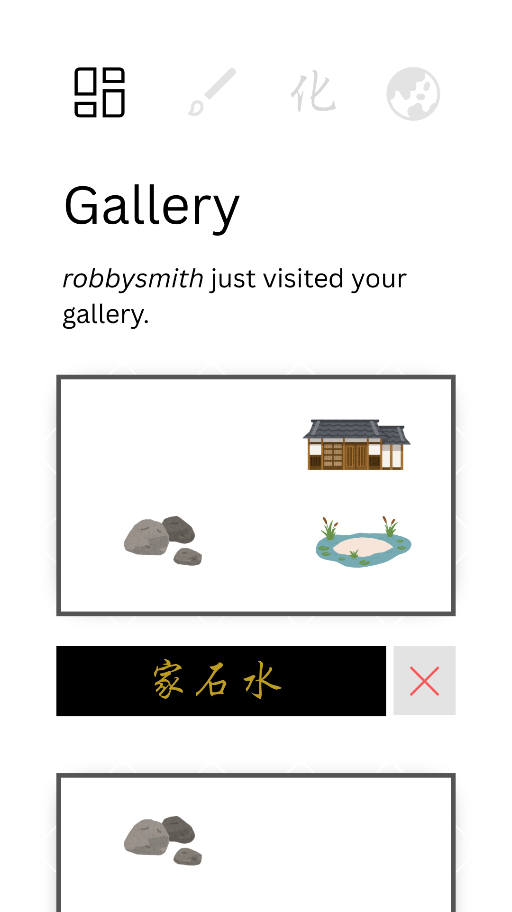
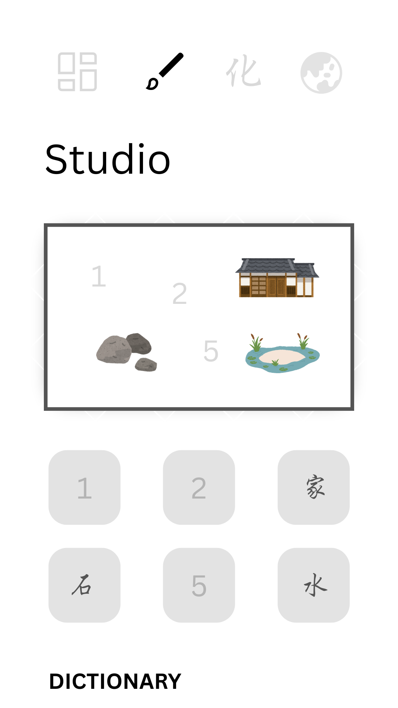
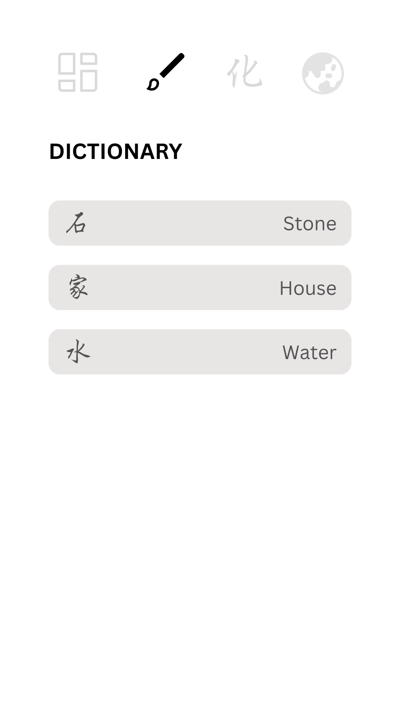
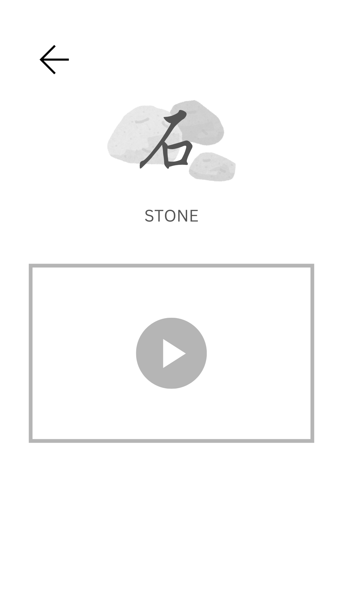
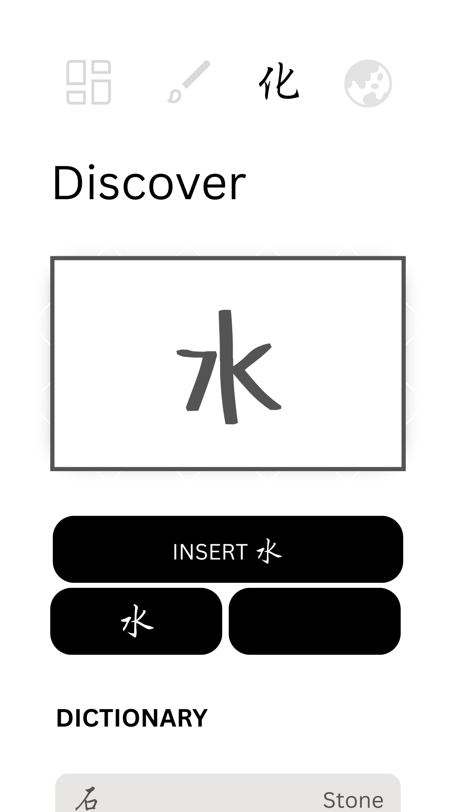
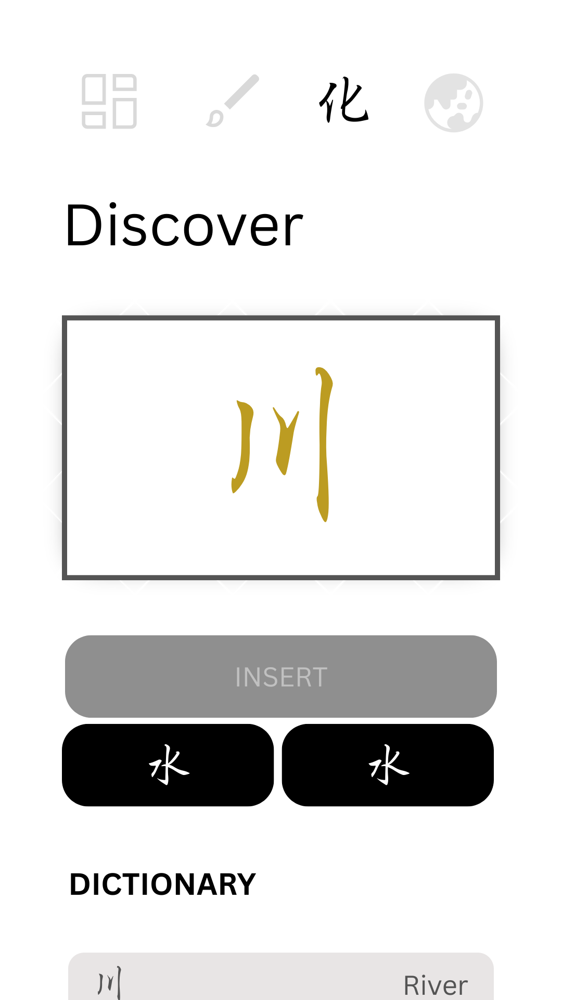
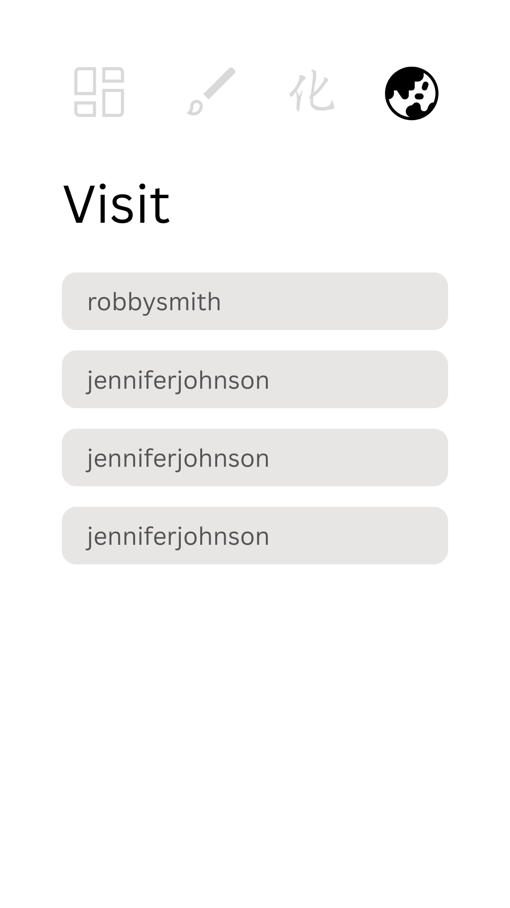
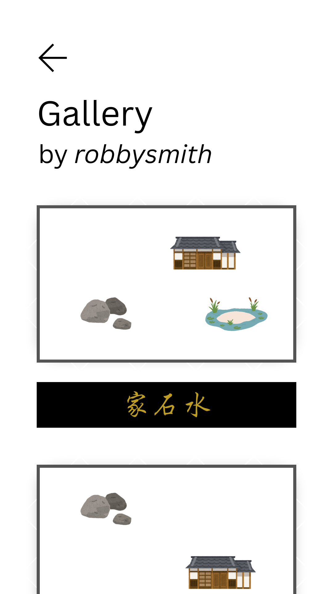

# Gardens of Ink

[My Notes](notes.md)

The writing system of Japan, so rich with depth and meaning, can take the extraordinary sights that surround an author and trap them into a single character. In this peaceful game, take the roles of calligrapher, painter, and gardener all at once as you liberate the mystic forms of Japanese kanji onto canvas. Come with no knowledge of Japanese art and writing, and leave with a serene appreciation of their beauty.

> [!NOTE]
>  This is a template for your startup application. You must modify this `README.md` file for each phase of your development. You only need to fill in the section for each deliverable when that deliverable is submitted in Canvas. Without completing the section for a deliverable, the TA will not know what to look for when grading your submission. Feel free to add additional information to each deliverable description, but make sure you at least have the list of rubric items and a description of what you did for each item.

> [!NOTE]
>  If you are not familiar with Markdown then you should review the [documentation](https://docs.github.com/en/get-started/writing-on-github/getting-started-with-writing-and-formatting-on-github/basic-writing-and-formatting-syntax) before continuing.

## 🚀 Specification Deliverable

> [!NOTE]
>  Fill in this sections as the submission artifact for this deliverable. You can refer to this [example](https://github.com/webprogramming260/startup-example/blob/main/README.md) for inspiration.

For this deliverable I did the following. I checked the box `[x]` and added a description for things I completed.

- [x] Proper use of Markdown
- [x] A concise and compelling elevator pitch
- [x] Description of key features
- [x] Description of how you will use each technology
- [ ] One or more rough sketches of your application. Images must be embedded in this file using Markdown image references.

### Elevator pitch

You cannot write either too slowly or too quickly, with too much pressure or with too little. You must be fully present in heart and mind, but both must also be completely empty. You should express your deepest passions, but they should flow out easily and effortlessly. You must always correct your technique, but you only ever get one chance to do anything―a brush stroke is irreversible. Many believe that the traditional way of writing is a path to enlightenment. I am making a game where you can mix and explore Japanese characters, use them to assemble tranquil gardens, and share your creations with the world.

### Design

<table>
  <tr>
    <td>
      
    </td>
    <td>
      
    </td>
    <td>
      
    </td>
  </tr>
  <tr>
    <td>
      
    </td>
    <td>
      
    </td>
    <td>
      
    </td>
  </tr>
  <tr>
    <td>
      
    </td>
    <td>
      
    </td>
    <td>
    </td>
  </tr>
</table>

### Key features

- Discover tab
  - The first element in this tab will be a kanji writing canvas with smoothing by [the Atrament library](https://github.com/jakubfiala/atrament) and handwriting recognition based on [kanjicanvas](https://github.com/asdfjkl/kanjicanvas)
  - An "Insert `{predictedCharacter}`" button will allow the user to fill two slots below
  - A "Clear slots" button will be added
  - Once both slots are filled, one of two things can happen: if their combination produces a valid character, a new character is discovered, displayed, and added to the dictionary (there will be a simple discovery tree, like "soil + air = person", "wood + person = house"); if not, the characters will simply fade away
  - A dictionary component (reused later) will show the characters and their simple meanings; clicking them will show a more detailed view with a stroke order video (gathered through [the Kanji Alive API](https://app.kanjialive.com/api/docs))
  - If I have time, I will add a component that displays combination hints in the form of haiku pre-generated by AI
- Studio tab
  - The main element is a canvas with six numbered spaces
  - Under the canvas are six slots where the user can select kanji they learned (dropdown list)
  - Selecting a kanji will render its representation on the canvas at the corresponding space (e.g., selecting the character for "stone" will display a "stone" asset, pre-generated by AI)
  - The dictionary component from before will be reused, perhaps also displaying the asset
- Gallery tab
  - Look at all your studio creations
  - Under each creation is a delete button and a little sign showing the kanji used
  - No edit function (strokes are irreversible)
- Visit tab
  - List of users, clicking one leads you to their gallery
  - When a user visits your gallery, a little status indicator appears with their initials (WebSocket)

### Technologies

I am going to use the required technologies in the following ways.

- **HTML** - Used to develop the structure and inputs for the app. I intend this to be an SPA, so there will only be one HTML file.
- **CSS** - Used to style everything from the tab bar to the user list. Should look good on different screen sizes and look simple and clean in general.
  - **React** - The main bulk of the work is done here, with interactive components, tabs, game logic, rendering assets, calling the API, etc.
- **Service** - Backend service with endpoints for:
  - Login
  - Storing and retrieving user galleries
  - Storing and retrieving user's discovered characters
- **DB/Login** - Stores users, galleries, and dictionaries in database. Save credentials securely.
- **WebSocket** - As a user visits a gallery, an indicator appears to the owner with their initials (which also links to the other user's gallery)

## 🚀 AWS deliverable

For this deliverable I did the following. I checked the box `[x]` and added a description for things I completed.

- [ ] **Server deployed and accessible with custom domain name** - [My server link](https://yourdomainnamehere.click).

## 🚀 HTML deliverable

For this deliverable I did the following. I checked the box `[x]` and added a description for things I completed.

- [ ] **HTML pages** - I did not complete this part of the deliverable.
- [ ] **Proper HTML element usage** - I did not complete this part of the deliverable.
- [ ] **Links** - I did not complete this part of the deliverable.
- [ ] **Text** - I did not complete this part of the deliverable.
- [ ] **3rd party API placeholder** - I did not complete this part of the deliverable.
- [ ] **Images** - I did not complete this part of the deliverable.
- [ ] **Login placeholder** - I did not complete this part of the deliverable.
- [ ] **DB data placeholder** - I did not complete this part of the deliverable.
- [ ] **WebSocket placeholder** - I did not complete this part of the deliverable.

## 🚀 CSS deliverable

For this deliverable I did the following. I checked the box `[x]` and added a description for things I completed.

- [ ] **Header, footer, and main content body** - I did not complete this part of the deliverable.
- [ ] **Navigation elements** - I did not complete this part of the deliverable.
- [ ] **Responsive to window resizing** - I did not complete this part of the deliverable.
- [ ] **Application elements** - I did not complete this part of the deliverable.
- [ ] **Application text content** - I did not complete this part of the deliverable.
- [ ] **Application images** - I did not complete this part of the deliverable.

## 🚀 React part 1: Routing deliverable

For this deliverable I did the following. I checked the box `[x]` and added a description for things I completed.

- [ ] **Bundled using Vite** - I did not complete this part of the deliverable.
- [ ] **Components** - I did not complete this part of the deliverable.
- [ ] **Router** - I did not complete this part of the deliverable.

## 🚀 React part 2: Reactivity deliverable

For this deliverable I did the following. I checked the box `[x]` and added a description for things I completed.

- [ ] **All functionality implemented or mocked out** - I did not complete this part of the deliverable.
- [ ] **Hooks** - I did not complete this part of the deliverable.

## 🚀 Service deliverable

For this deliverable I did the following. I checked the box `[x]` and added a description for things I completed.

- [ ] **Node.js/Express HTTP service** - I did not complete this part of the deliverable.
- [ ] **Static middleware for frontend** - I did not complete this part of the deliverable.
- [ ] **Calls to third party endpoints** - I did not complete this part of the deliverable.
- [ ] **Backend service endpoints** - I did not complete this part of the deliverable.
- [ ] **Frontend calls service endpoints** - I did not complete this part of the deliverable.
- [ ] **Supports registration, login, logout, and restricted endpoint** - I did not complete this part of the deliverable.

## 🚀 DB deliverable

For this deliverable I did the following. I checked the box `[x]` and added a description for things I completed.

- [ ] **Stores data in MongoDB** - I did not complete this part of the deliverable.
- [ ] **Stores credentials in MongoDB** - I did not complete this part of the deliverable.

## 🚀 WebSocket deliverable

For this deliverable I did the following. I checked the box `[x]` and added a description for things I completed.

- [ ] **Backend listens for WebSocket connection** - I did not complete this part of the deliverable.
- [ ] **Frontend makes WebSocket connection** - I did not complete this part of the deliverable.
- [ ] **Data sent over WebSocket connection** - I did not complete this part of the deliverable.
- [ ] **WebSocket data displayed** - I did not complete this part of the deliverable.
- [ ] **Application is fully functional** - I did not complete this part of the deliverable.
